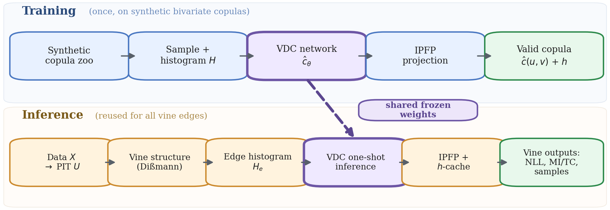
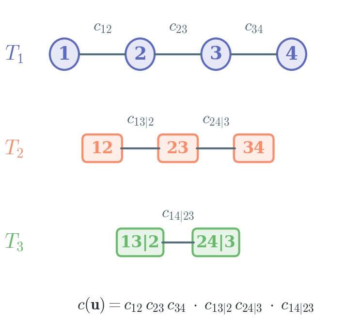

# Vine Diffusion Copula (VDC)

<p>
  <a href="https://github.com/KempnerInstitute/vine-diffusion-copula/actions/workflows/ci.yml"></a>
  <a href="https://github.com/KempnerInstitute/vine-diffusion-copula"></a>
  <a href="https://github.com/KempnerInstitute/vine-diffusion-copula/blob/main/LICENSE"></a>
  <a href="https://huggingface.co/hsafaai/vdc-denoiser-m64-v1"></a>
</p>

**VDC** is a method for fast high-dimensional vine copula inference via amortized bivariate estimation. It trains a single neural edge estimator once on synthetic copulas and reuses it across all O(d^2) vine edges, replacing expensive per-edge optimization with cheap GPU forward passes while preserving exact copula semantics.

<p align="center">
  
</p>

## Key Features

- **Amortized bivariate estimation**: train-once denoising edge estimator + IPFP projection to guarantee valid copula densities
- **Fast vine fitting**: GPU-batched edge estimation with cached h-functions for D-vine, C-vine, and R-vine structures
- **Information estimation**: MI and total correlation from explicit copula densities, with edge-wise decomposition
- **Self-consistent estimates**: 0% DPI violations under tested MI consistency protocol

<p align="center">
  
</p>

## Quick Start

### Install

```bash
git clone https://github.com/KempnerInstitute/vine-diffusion-copula.git
cd vine-diffusion-copula
conda env create -f environment.yml
conda activate vdc
pip install -e .
```

### Use the released model

```bash
python scripts/download_pretrained.py --model-id vdc-denoiser-m64-v1
python examples/use_pretrained_model.py --model-id vdc-denoiser-m64-v1
```

### Python API

```python
import numpy as np
from vdc import estimate_pair_density_from_samples, load_pretrained_model

# Load pretrained edge estimator
bundle = load_pretrained_model("vdc-denoiser-m64-v1", device="cpu")

# Estimate a bivariate copula density
u = np.random.rand(2000, 2)
density = estimate_pair_density_from_samples(bundle, u)
print(density.shape)  # (64, 64)
```

### Fit a vine copula

```python
import numpy as np
from vdc import VineCopulaModel, load_pretrained_model

bundle = load_pretrained_model("vdc-denoiser-m64-v1", device="cpu")
U = np.random.rand(1000, 5)

vine = VineCopulaModel(vine_type="dvine", m=bundle.config["data"]["m"], device="cpu")
vine.fit(U, bundle.model, diffusion=bundle.diffusion)

# Evaluate
loglik = vine.logpdf(U)
samples = vine.simulate(n=500)
```

### Command-line tools

The installed `vdc` command exposes a small stable release surface:

```bash
vdc list-models
vdc resolve-model --model-id vdc-denoiser-m64-v1
vdc estimate-pair data/pair.npy --output results/density.npy
vdc fit-vine data/pseudo_obs.npy --output results/vine.pkl --vine-type dvine
```

## Core Workflow

The inference pipeline consists of four steps:

1. Build a normalized histogram from bivariate pseudo-observations
2. Predict a positive density grid with the frozen pretrained model
3. Project the grid to a valid copula via IPFP (uniform marginals, unit mass)
4. Reuse the resulting pair-copula estimator inside vine recursion and information calculations

## Released Model

The packaged released model is `vdc-denoiser-m64-v1`. The published weights live on [Hugging Face](https://huggingface.co/hsafaai/vdc-denoiser-m64-v1), and the release workflow is documented in [docs/MODEL_RELEASES.md](docs/MODEL_RELEASES.md).

### Verification

```bash
python scripts/verify_pretrained_release.py \
  --model-id vdc-denoiser-m64-v1 \
  --device cpu \
  --out-dir docs/reports/pretrained_release
```

The verification checks analytic bivariate cases (Gaussian, Clayton, Frank, Gumbel), mass preservation after IPFP projection, and MI accuracy from the released checkpoint.

Reports:
- [Pretrained release verification](docs/reports/pretrained_release/PRETRAINED_RELEASE_VERIFICATION.md)
- [MI benchmark](docs/reports/pretrained_release/MI_BENCHMARK_DCD_RELEASE.md)

## Training

Train a denoiser:

```bash
python scripts/train_unified.py --config configs/train/denoiser_cond.yaml --model-type denoiser
```

Train a diffusion-style model:

```bash
python scripts/train_unified.py --config configs/train/diffusion_cond.yaml --model-type diffusion_unet
```

Evaluate a checkpoint:

```bash
python scripts/evaluate.py --checkpoint checkpoints/model.pt
python scripts/model_selection.py --checkpoints checkpoints/*/model_step_*.pt --n-samples 2000
```

## Documentation

- [Getting Started](docs/GETTING_STARTED.md)
- [User Guide](docs/USER_GUIDE.md)
- [API Reference](docs/API.md)
- [Configuration](docs/CONFIGURATION.md)
- [Model Releases](docs/MODEL_RELEASES.md)
- [Paper Reproducibility](docs/PAPER_REPRODUCIBILITY.md)

## Reproducing the paper

Every number, table, and figure in the paper is regenerated from stored experiment artifacts by `drafts/scripts/paper_artifacts.py`. The canonical workflow is:

1. Install the package and download the released checkpoint:
   ```bash
   pip install -e .
   python scripts/download_pretrained.py --model-id vdc-denoiser-m64-v1
   ```
2. Run benchmarks (each produces JSON artifacts under `drafts/paper_outputs/`). See `slurm/PAPER_JOBS.md` for the full list; representative runs:
   ```bash
   bash slurm/paper_e2_uci.sh                       # UCI copula-space density
   bash slurm/paper_e13_ablation_depth_dense.sh     # corruption ablation
   bash slurm/paper_mi_benchmark.sh                 # MI estimation
   bash slurm/paper_tc_benchmark.sh                 # TC scaling
   bash slurm/paper_seed_variance_array.sh          # 3-seed variance sweep
   ```
3. Regenerate figures and tables:
   ```bash
   python drafts/scripts/paper_artifacts.py all
   ```
4. Build the paper (ICML two-column):
   ```bash
   cd drafts && pdflatex vine_diffusion.tex && bibtex vine_diffusion \
     && pdflatex vine_diffusion.tex && pdflatex vine_diffusion.tex
   ```
   For the single-column arXiv variant use `vine_diffusion_arxiv.tex`. Both wrappers share the same content under `drafts/content/`.

## Citation

If you use this code or the Vine Denoising Copula method, please cite:

```bibtex
@misc{vdc2026,
  title        = {Amortized Vine Copulas for High-Dimensional Density and Information Estimation},
  howpublished = {Kempner Institute at Harvard University},
  year         = {2026},
}
```

A machine-readable citation record is available in [CITATION.cff](CITATION.cff).

## License

MIT; see [LICENSE](LICENSE).

## Notes

- The released model assumes continuous marginals and pseudo-observations in `[0,1]`.
- Vine fitting uses the simplifying assumption (constant conditional copulas).
- The released checkpoint is frozen and versioned.
- Current grid resolution is m=64. Extensions to larger grids and the probit transform are documented in the configuration guide.
